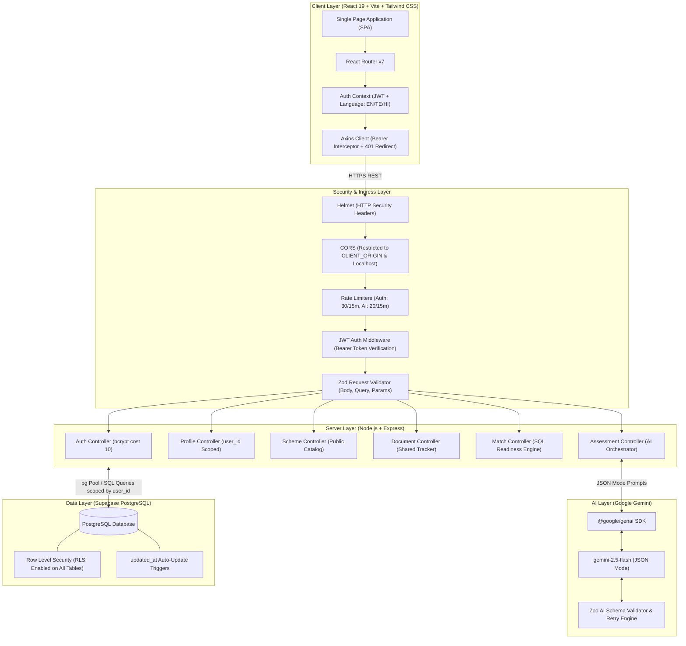
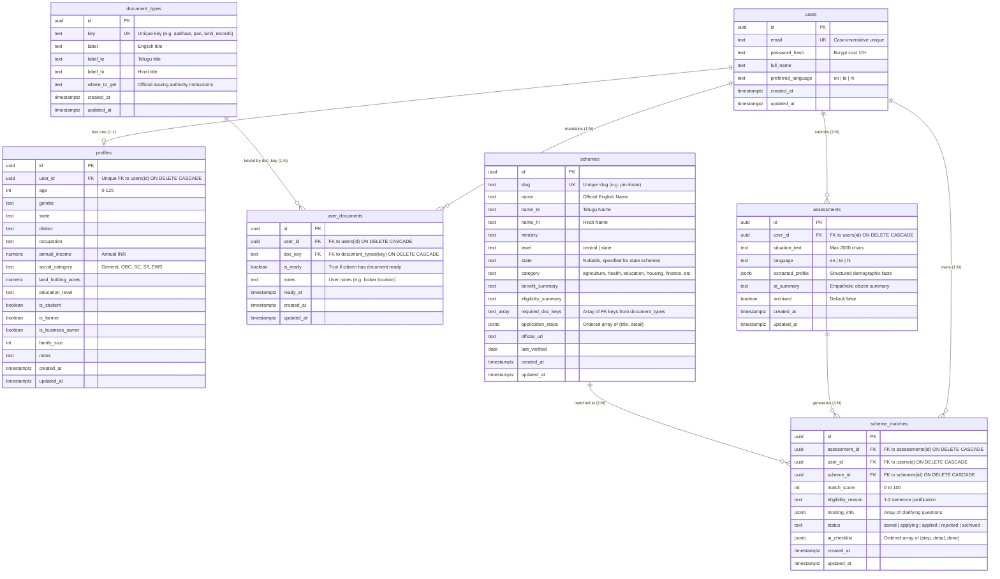

# PolicyPal — System Architecture & Database Design

## 1. Problem Statement
Across India, over 800 Central and State government welfare programs offer critical direct benefit transfers (DBT), subsidized loans, healthcare coverage, and educational scholarships. However, tens of millions of deserving citizens—including smallholders, sharecroppers, informal laborers, artisans, and underprivileged students—never benefit because:
- **Linguistic and Bureaucratic Disconnect**: Scheme guidelines are published in dense administrative legalese, predominantly in standard English or official Hindi.
- **Fragmented Discovery**: Eligibility criteria are scattered across dozens of ministry websites and state portals (e.g., pmkisan.gov.in, myscheme.gov.in, dharani.telangana.gov.in).
- **The Redundant Documentation Burden**: Every time a citizen applies for a scheme, they must re-verify which certificates they possess. A single document (like an Aadhaar Card or Bank Passbook) is shared by dozens of schemes, yet no existing portal tracks cross-scheme readiness.

**PolicyPal** solves this by providing:
1. Natural language voice/text input in **English, Telugu (తెలుగు), and Hindi (हिन्दी)**.
2. AI-driven profile extraction and eligibility matching powered by **Google Gemini 2.5 Flash**.
3. **The Shared Document Readiness Tracker**: Ticking a document as ready once instantly updates readiness percentages across *every* scheme requiring that certificate, highlighting the schemes closest to completion.

---

## 2. User Roles & Personas
- **Citizen / Applicant (Authenticated)**:
  - Submits free-form situations in everyday language.
  - Receives match scores (0–100), customized justification reasons, and personalized 4–7 step checklists.
  - Manages the unified Document Tracker (16 shared national document types).
  - Tracks application lifecycles: `saved` → `applying` → `applied` → `rejected` / `archived`.
- **Public Explorer (Guest)**:
  - Explores the public catalog of 20+ verified central and state schemes with instant search, category filtering, and level toggles.
  - Experiments with the interactive live Document Readiness Tracker demo on the landing page.
- **PolicyPal Backend Service (Internal)**:
  - The single authorized database consumer connecting with secure service-level credentials.
  - Orchestrates Gemini GenAI calls, validates AI outputs against Zod schemas, and calculates mathematical readiness in SQL.

---

## 3. High-Level System Architecture



---

## 4. Database Schema & Relational Structure

All tables use standard UUID v4 primary keys (`DEFAULT gen_random_uuid()`) and UTC timestamps with timezone (`TIMESTAMPTZ`).



---

## 5. Assessment Request Flow

The following sequence diagram details the end-to-end processing of a citizen's situation description:

```mermaid
sequenceDiagram
    autonumber
    actor Citizen as Citizen (Browser)
    participant Client as React Client (Axios)
    participant Gateway as Express Gateway & Middlewares
    participant Cache as Assessment Cache (24h Window)
    participant AI as Gemini Service (@google/genai)
    participant DB as Supabase PostgreSQL

    Citizen->>Client: Enters situation in Telugu/Hindi/English & clicks "Find My Schemes"
    Client->>Gateway: POST /api/assessments (Authorization: Bearer <JWT>)
    Gateway->>Gateway: Rate limiter check (max 20 / 15 min)
    Gateway->>Gateway: Zod Schema validation (10 <= text.length <= 2000)
    Gateway->>Gateway: JWT verification & user_id extraction
    
    Gateway->>Cache: Query DB for identical situation_text & language within 24h
    alt Identical submission exists within 24 hours
        Cache-->>Gateway: Return existing cached assessment & matches
    else Cache Miss (Fresh Evaluation)
        Gateway->>AI: 1. extractProfile(text, language) [Timeout: 25s]
        AI-->>Gateway: Returns structured facts, summary, missing questions
        Gateway->>DB: Fetch compact schemes catalog (id, slug, rules, docs)
        DB-->>Gateway: Catalog rows
        Gateway->>AI: 2. matchSchemes(profile, catalog, language)
        AI-->>Gateway: Candidate scheme IDs + scores + reasons
        Gateway->>Gateway: Validate scheme IDs exist in catalog; drop unknown/hallucinations
        Gateway->>AI: 3. buildChecklistsForMatches(profile, matches, language) [Concurrency Cap = 3]
        AI-->>Gateway: Personalized 4-7 step checklists
        Gateway->>DB: INSERT INTO assessments (...)
        Gateway->>DB: INSERT INTO scheme_matches (...)
        Gateway->>DB: UPDATE profiles (sync empty demographic fields)
    end

    Gateway->>DB: Compute document readiness from user_documents
    DB-->>Gateway: Matched rows with required_documents & readiness_percent
    Gateway-->>Client: HTTP 201 { success: true, data: { assessment, matches } }
    Client-->>Citizen: Renders Assessment Result (Summary, Match Badges, Checklists)
```

---

## 6. Security Rationale: Row Level Security with No Public Policies

A foundational security requirement of PolicyPal is:
> **"Enable Row Level Security on all tables with no public policies, since only the backend connects."**

### Architectural Justification
1. **Zero Client-Side Direct Database Access**:
   - The Supabase client library is **not** included in the frontend bundle. The browser never interacts directly with Supabase APIs (`supabase.from(...)` is absent).
   - This guarantees that API secrets, direct table schemas, and database connection strings cannot be reverse-engineered from JavaScript sourcemaps or browser memory.
2. **Backend Authentication & Authorization Barrier**:
   - All client interactions route through the Express REST API protected by signed JSON Web Tokens (JWT) verified via `requireAuth` middleware.
   - The server connects to PostgreSQL using a single trusted connection pool (`pg.Pool`).
3. **Defense-in-Depth Against Database Leaks**:
   - Enabling RLS with `ALTER TABLE <tablename> ENABLE ROW LEVEL SECURITY;` without adding any `CREATE POLICY ... FOR SELECT TO anon, authenticated` ensures that even if Supabase PostgREST or Supabase GraphQL ports were accidentally exposed publicly, any unauthenticated or anonymously authenticated web query returns **zero rows**.
4. **Strict Server-Side Scoping by `user_id`**:
   - Every read, update, patch, and delete SQL statement strictly embeds `WHERE user_id = $1` using parameterized queries (e.g. `SELECT * FROM assessments WHERE id = $1 AND user_id = $2`).
   - If a user attempts to view, mutate, or delete another user's assessment or match, the query returns 0 rows, resulting in an immediate **HTTP 404 Not Found**, eliminating IDOR (Insecure Direct Object Reference) vulnerabilities.
